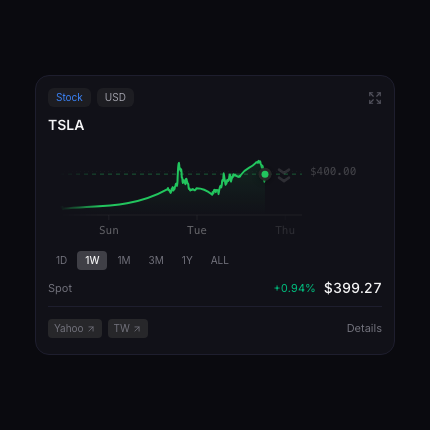
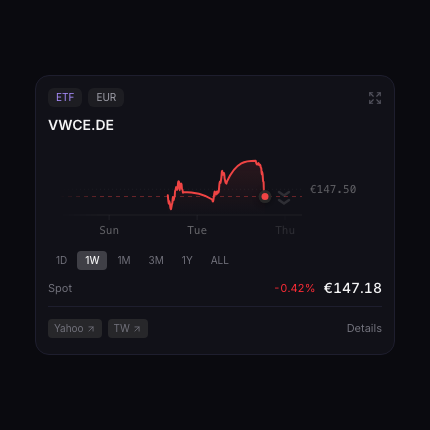
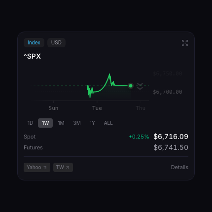
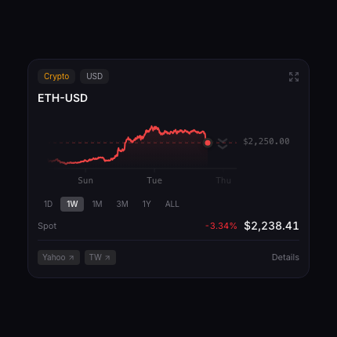
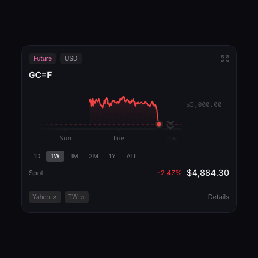
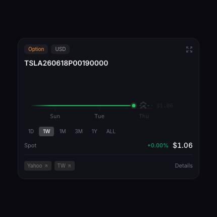
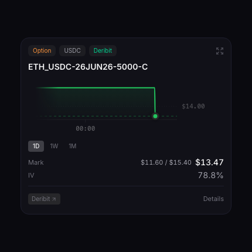
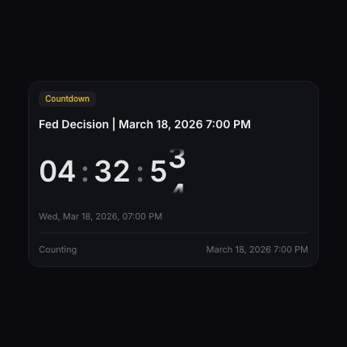

# Intel

Market-watching hub. Running most of the day on my spare desktop screen.

Designed for tracking stocks, ETFs, crypto, options (stock or crypto), futures, live financial feeds in a clean UI.

[Features](#features) ⋅ [Tracked items](#tracked-items) ⋅ [Deploy your own](#quickstart)


### Features

| Details                            | Item enhancements                    | Export-able watchlist              |
| :--------------------------------- | :----------------------------------- | :--------------------------------- |
|  |  |  |

**Real-time asset grid** — interactive charts for stocks, ETFs, crypto, options (incl. crypto through Deribit), indexes, bonds, futures

**Watchlist** — drag-to-reorder, ticker search, per-item settings (futures symbol overrides). Import/export via URL or QR code to share lists across devices.

**Earnings and events** — upcoming earnings dates (relative to device time) and FOMC meetings

**Market hours** — live open/close status for various exchanges

**Embeddable special items** — in-grid live YouTube feeds (e.g. Bloomberg)

**Tips slideshow** — rotating tips in the sidebar for discoverability

### Tracked Items

| Item / Asset    | How to search          | Example                                                     | Preview                                                     |
| :-------------- | :--------------------- | :---------------------------------------------------------- | :---------------------------------------------------------- |
| Stock           | Company name or ticker | `AAPL`, `SNN.RO`                                            |           |
| ETF             | Fund name or ticker    | `VWCE.DE`, `SPY`                                            |             |
| Index           | Index name or ticker   | `^GSPC`, `^DJI` — Yahoo prefixes with `^`                   |           |
| Crypto          | Coin name              | `BTC-USD`, `ETH-USD` — pairs with USD                       |          |
| Future          | Futures symbol         | `ES=F`, `GC=F` — Yahoo suffixes with `=F`                   |          |
| Option (stock)  | Option ticker          | `TSLA250321C00250000` — `<Ticker><YYMMDD><C\|P><00Price00>` |    |
| Option (crypto) | "Deribit" + ticker     | `Deribit <Ticker>_USDC-<DDMMMYY>-<Price>-<C\|P>`            |  |
| Live feed       | "Bloomberg" or "Yahoo" | YouTube embed in grid                                       |           |
| Countdown       | Countdown              | `May 16th 9PM` or Natural language                          |       |

## Quickstart

### Run a local copy

```bash
git clone https://github.com/razgraf/intel.git && cd intel
bun install
bun dev
```

No API keys required — data (Yahoo Finance, Deribit) is fetched server-side without authentication. Open at [http://localhost:3100](http://localhost:3100).

### Deploy your own instance

Deploy your own copy of Intel to Vercel in one click.

[](https://vercel.com/new/clone?repository-url=https://github.com/razgraf/intel&project-name=intel-by-razgraf)

### Tech stack and plans

<details>
<summary>Tech stack</summary>

| Layer        | Tech                                                                                                                                            |
| :----------- | :---------------------------------------------------------------------------------------------------------------------------------------------- |
| Framework    | Next.js 16 (with `use cache`, new React 19 directives)                                                                                          |
| UI           | Tailwind CSS 4, Base UI primitives, Lucide icons                                                                                                |
| Charts       | [Liveline](https://benji.org/liveline)                                                                                                          |
| Numbers      | [Caligraph](https://calligraph.raphaelsalaja.com/), [Number Flow](https://number-flow.barvian.me/), [Chrono](https://github.com/wanasit/chrono) |
| Animations   | Framer Motion                                                                                                                                   |
| State        | Zustand, TanStack Query                                                                                                                         |
| Data         | Yahoo Finance via `yahoo-finance2`, USDC-settled options via `deribit`                                                                          |
| Dev tooling  | [Agentation](https://agentation.dev/), Biome, TypeScript 5                                                                                      |
| Runtime      | Bun                                                                                                                                             |
| Architecture | FSD                                                                                                                                             |
| AI           | Claude, Codex                                                                                                                                   |

</details>

<details>
<summary>Roadmap</summary>

- [x] Deribit options
- [ ] Polymarket or Kalshi markets
- [ ] Price alerts and notifications
- [ ] More reliable data sources (Yahoo may rate-limit or be incomplete), maybe Alpha Vantage (?)
- [ ] More special grid items (keyword trackers, AI-generated market reports, news feeds)
- [ ] Commercial version with paid subscriptions
</details>

## License

MIT
